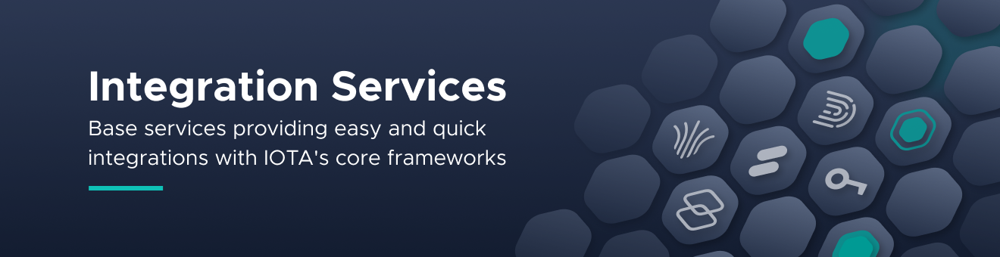

<!-- This READM is based on the BEST-README-Template (https://github.com/othneildrew/Best-README-Template) -->
<div id="top"></div>
<!--
*** Thanks for checking out the Best-README-Template. If you have a suggestion
*** that would make this better, please fork the repo and create a pull request
*** or simply open an issue with the tag "enhancement".
*** Don't forget to give the project a star!
*** Thanks again! Now go create something AMAZING! :D
-->


<!-- PROJECT SHIELDS -->
<!--
*** I'm using markdown "reference style" links for readability.
*** Reference links are enclosed in brackets [ ] instead of parentheses ( ).
*** See the bottom of this document for the declaration of the reference variables
*** for contributors-url, forks-url, etc. This is an optional, concise syntax you may use.
*** https://www.markdownguide.org/basic-syntax/#reference-style-links
-->
[![Downloads][downloads-shield]][npm-url]
[![Version][npm-version-shield]][npm-url]
[![Contributors][contributors-shield]][contributors-url]
[![Stargazers][stars-shield]][stars-url]
[![Issues][issues-shield]][issues-url]
[![Apache 2.0 license][license-shield]][license-url]
[![Discord][discord-shield]][discord-url]
[![StackExchange][stackexchange-shield]][stackexchange-url]
<!-- Add additional Badges. Some examples >


<!-- PROJECT LOGO -->
<br />
<div align="center">
    <a href="https://github.com/iotaledger/is-cli">
        
    </a>
    <h3 align="center">IS-CLI</h3>
    <p align="center">
        The Command Line Interface for the Integration Services. Setup the IS-API, manage Identities and Channels with ease.
        <br />
        <br />
        <a href="https://github.com/iotaledger/is-cli/labels/bug">Report Bug</a>
        ·
        <a href="https://github.com/iotaledger/is-cli/labels/request">Request Feature</a>
    </p>
</div>


<!-- TABLE OF CONTENTS -->
<!-- TODO 
Edit the ToC to your needs. If your project is part of the wiki, you should link directly to the Wiki where possible and remove unneeded sections to prevent duplicates 
-->
<details>
  <summary>Table of Contents</summary>
  <ol>
    <li>
      <a href="#about-the-project">About The Project</a>
      <ul>
        <li><a href="#built-with">Built With</a></li>
      </ul>
    </li>
    <li>
      <a href="#getting-started">Getting Started</a>
      <ul>
        <li><a href="#prerequisites">Prerequisites</a></li>
        <li><a href="#installation">Installation</a></li>
      </ul>
    </li>
    <li><a href="#usage">Usage</a></li>
    <li><a href="#roadmap">Roadmap</a></li>
    <li><a href="#contributing">Contributing</a></li>
    <li><a href="#license">License</a></li>
    <li><a href="#contact">Contact</a></li>
  </ol>
</details>


<!-- ABOUT THE PROJECT -->
## About The Project

This is the IS-CLI for easy interaction with the [IOTA Integration Services](https://github.com/iotaledger/integration-services). Create and manage Identities, Verifiable Credentials, Channels via command line.

<p align="right">(<a href="#top">back to top</a>)</p>

### Built With

* [IOTA IS-Client](https://www.npmjs.com/package/@iota/is-client)
* [commander](https://www.npmjs.com/package/commander)
* [nconf](https://www.npmjs.com/package/nconf)

<p align="right">(<a href="#top">back to top</a>)</p>


<!-- GETTING STARTED -->
## Getting Started

This is an example of how you may give instructions on setting up your project locally.
To get a local copy up and running follow these simple example steps.

### Prerequisites

-   min. Node v15.6.0

### Installation

```sh
npm install -g @iota/is-cli@latest
```

or for one-time use

```sh
npx @iota/is-cli <command>
```

<p align="right">(<a href="#top">back to top</a>)</p>


<!-- USAGE EXAMPLES -->
## Usage

### Configure CLI for local API access 
```sh
is config -s http://localhost:3001 -a http://localhost:3002 -k <your-api-key>
```

### Configure API environment
```sh
is setup-node
```

### View all commands
```
is help
```

-   For most of the channel and identity commands is a `identity.json` in the directory where the cli is executed needed.

<p align="right">(<a href="#top">back to top</a>)</p>


<!--EXAMPLES -->
## Examples

### Create two identities
```sh
is create-identity -i examples/identityA.json -o identityA.json 
```
```sh
is create-identity -i examples/identityB.json -o identityB.json 
```

### Create a public channel
```sh
is create-channel -i identityA.json -t logs -s device -o channelA.json -pC test-channel
```
#### For private channels remove option `-pC`

### Write to channel
```sh
is write-channel -i identityA.json -p "hello world" <Channel address of channelA>
```

### Request subscription 
```sh
is subscribe-channel -i identityB.json <Channel address of channelA>
```

### Authorize subscription
```sh
is authorize-subscription -i identityA.json <Channel address of channelA> <Id of identityB>
```

### Write message as subscriber
```sh
is write-channel -i identityB.json -p "Can you hear me?" <Channel address of channelA>
```

### Read channel
```sh
is read-channel -i identityB.json <Channel address of channelA> 
```

### Read history for public channel
```sh
is read-channel-history -i identityB.json -pC <Channel address of channelA> 
```
#### For private channels remove option `-pC`and provide the preshared key with option `-psK`

### Revoke subscription 
```sh
is revoke-subscription -i identityA.json -sI <Id of identityB> <Channel address of channelA> 
```

### Check if subscription is revoked 
```sh
is find-subscription -i identityA.json -sI <Id of identityB> <Channel address of channelA> 
```


<!-- ROADMAP -->
## Roadmap

- [x] IS API setup script
- [x] Add all IS-Client commands to the cli


See the [open issues](https://github.com/iotaledger/is-cli/issues) for a full list of proposed features (and known issues).

<p align="right">(<a href="#top">back to top</a>)</p>


<!-- CONTRIBUTING -->
## Contributing

Contributions are what make the open source community such an amazing place to learn, inspire, and create. Any contributions you make are **greatly appreciated**.

If you have a suggestion that would make this better, please fork the repo and create a pull request. You can also simply open an issue with the tag "enhancement".
Don't forget to give the project a star! Thanks again!

1. Fork the Project
2. Create your Feature Branch (`git checkout -b feature/AmazingFeature`)
3. Commit your Changes (`git commit -m 'Add some AmazingFeature'`)
4. Push to the Branch (`git push origin feature/AmazingFeature`)
5. Open a Pull Request

<p align="right">(<a href="#top">back to top</a>)</p>


<!-- LICENSE -->
## License

Distributed under the Apache License. See `LICENSE` for more information.

<p align="right">(<a href="#top">back to top</a>)</p>


<!-- CONTACT -->
## Contact

Tim Sigl - [@Schereo](https://twitter.com/schereo) - tim.sigl@iota.org <br>
Juri Bogatyrjow - juri.bogatyrjow@iota.org

Project Link: [https://github.com/iotaledger/is-cli](https://github.com/iotaledger/is-cli)

<p align="right">(<a href="#top">back to top</a>)</p>


<!-- MARKDOWN LINKS & IMAGES -->
<!-- https://www.markdownguide.org/basic-syntax/#reference-style-links -->
[contributors-shield]: https://img.shields.io/github/contributors/iotaledger/is-cli?style=for-the-badge
[contributors-url]: https://github.com/iotaledger/is-cli/graphs/contributors
[npm-url]: https://www.npmjs.com/package/@iota/is-cli
[downloads-shield]: https://img.shields.io/npm/dw/@iota/is-cli?style=for-the-badge
[npm-version-shield]: https://img.shields.io/npm/v/@iota/is-cli?style=for-the-badge
[stars-shield]: https://img.shields.io/github/stars/iotaledger/is-cli?style=for-the-badge
[stars-url]: https://github.com/iotaledger/is-cli/stargazers
[issues-shield]: https://img.shields.io/github/issues/iotaledger/is-cli?style=for-the-badge
[issues-url]: https://github.com/iotaledger/is-cli/issues
[license-shield]: https://img.shields.io/github/license/iotaledger/is-cli?style=for-the-badge
[license-url]: https://github.com/iotaledger/is-cli/blob/refactoring/LICENSE
[discord-shield]: https://img.shields.io/badge/Discord-9cf.svg?style=for-the-badge&logo=discord
[discord-url]: https://discord.com/channels/397872799483428865/910192737842790400
[stackexchange-shield]: https://img.shields.io/badge/StackExchange-9cf.svg?style=for-the-badge&logo=stackexchange
[stackexchange-url]: https://iota.stackexchange.com
